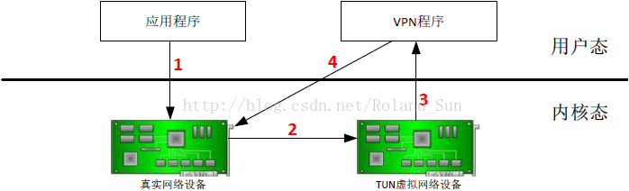
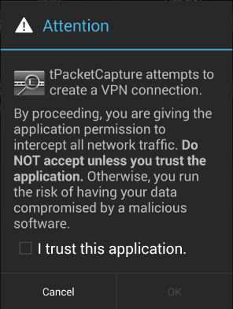
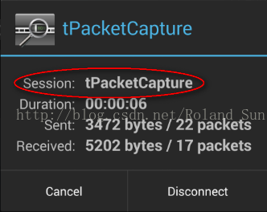

-----
title: Android自带VPN服务框架学习
tags: 
   - Android
   - VpnService
-----

Android从4.0开始（API LEVEL 15），增加了VpnService这个API，在不用root的情况下就可以使用。

一、基本原理

在介绍如何使用这些新增的API之前，先来说说其基本的原理。

Android设备上，如果已经使用了VpnService框架，建立起了一条从设备到远端的VPN链接，那么数据包在设备上大致经历了如下四个过程的转换：



1）应用程序使用socket，将相应的数据包发送到真实的网络设备上。一般移动设备只有无线网卡，因此是发送到真实的WiFi设备上；

2）Android系统通过iptables，使用NAT，将所有的数据包转发到TUN虚拟网络设备上去，端口是tun0；

3）VPN程序通过打开/dev/tun设备，并读取该设备上的数据，可以获得所有转发到TUN虚拟网络设备上的IP包。因为设备上的所有IP包都会被NAT转成原地址是tun0端口发送的，所以也就是说你的VPN程序可以获得进出该设备的几乎所有的数据（也有例外，不是全部，比如回环数据就无法获得）；

4）VPN数据可以做一些处理，然后将处理过后的数据包，通过真实的网络设备发送出去。为了防止发送的数据包再被转到TUN虚拟网络设备上，VPN程序所使用的socket必须先被明确绑定到真实的网络设备上去。

二、代码实现

要实现Android设备上的VPN程序，一般需要分别实现一个继承自Activity类的带UI的客户程序和一个继承自VpnService类的服务程序。

申明Service

要想让你的VPN程序正常运行，首先必须要在AndroidManifest.xml申明Service
```
 <service android:name=".service.MyVpnService"
            android:permission="android.permission.BIND_VPN_SERVICE">
            <intent-filter>
                <action android:name="android.net.VpnService"/>
            </intent-filter>
        </service>
```

客户程序实现

客户程序一般要首先调用VpnService.prepare函数：

```
Intent intent = VpnService.prepare(this);  
if (intent != null) {  
    startActivityForResult(intent, 0);  
} else {  
    onActivityResult(0, RESULT_OK, null);  
}  
```

目前Android只支持一条VPN连接，如果新的程序想建立一条VPN连接，必须先中断系统中当前存在的那个VPN连接。

同时，由于VPN程序的权利实在太大了，所以在正式建立之前，还要弹出一个对话框，让用户点头确认。



VpnService.prepare函数的目的，主要是用来检查当前系统中是不是已经存在一个VPN连接了，如果有了的话，是不是就是本程序创建的。

如果当前系统中没有VPN连接，或者存在的VPN连接不是本程序建立的，则VpnService.prepare函数会返回一个intent。这个intent就是用来触发确认对话框的，程序会接着调用startActivityForResult将对话框弹出来等用户确认。如果用户确认了，则会关闭前面已经建立的VPN连接，并重置虚拟端口。该对话框返回的时候，会调用onActivityResult函数，并告之用户的选择。

如果当前系统中有VPN连接，并且这个连接就是本程序建立的，则函数会返回null，就不需要用户再确认了。因为用户在本程序第一次建立VPN连接的时候已经确认过了，就不要再重复确认了，直接手动调用onActivityResult函数就行了。

在onActivityResult函数中，处理相对简单：

```
protected void onActivityResult(int request, int result, Intent data) {  
    if (result == RESULT_OK) {  
        Intent intent = new Intent(this, MyVpnService.class);  
        ...  
        startService(intent);  
    }  
}  
```

如果返回结果是OK的，也就是用户同意建立VPN连接，则将你写的，继承自VpnService类的服务启动起来就行了。

当然，你也可以通过intent传递一些别的参数。

服务程序实现

服务程序必须要继承自android.net.VpnService类：

```
public class MyVpnService extends VpnService ...  
```
VpnService类封装了建立VPN连接所必须的所有函数，后面会逐步用到。

建立链接的第一步是要用合适的参数，创建并初始化好tun0虚拟网络端口，这可以通过在VpnService类中的一个内部类Builder来做到：

```
Builder builder = new Builder();  
builder.setMtu(...);  
builder.addAddress(...);  
builder.addRoute(...);  
builder.addDnsServer(...);  
builder.addSearchDomain(...);  
builder.setSession(...);  
builder.setConfigureIntent(...);  
```
  
ParcelFileDescriptor interface = builder.establish();  
可以看到，这里使用了标准的Builder设计模式。在正式建立（establish）虚拟网络接口之前，需要设置好几个参数，分别是：

1）MTU（Maximun Transmission Unit），即表示虚拟网络端口的最大传输单元，如果发送的包长度超过这个数字，则会被分包；

2）Address，即这个虚拟网络端口的IP地址；

3）Route，只有匹配上的IP包，才会被路由到虚拟端口上去。如果是0.0.0.0/0的话，则会将所有的IP包都路由到虚拟端口上去；

4）DNS Server，就是该端口的DNS服务器地址；

5）Search Domain，就是添加DNS域名的自动补齐。DNS服务器必须通过全域名进行搜索，但每次查找都输入全域名太麻烦了，可以通过配置域名的自动补齐规则予以简化；

6）Session，就是你要建立的VPN连接的名字，它将会在系统管理的与VPN连接相关的通知栏和对话框中显示出来；



7）Configure Intent，这个intent指向一个配置页面，用来配置VPN链接。它不是必须的，如果没设置的话，则系统弹出的VPN相关对话框中不会出现配置按钮。

最后调用Builder.establish函数，如果一切正常的话，tun0虚拟网络接口就建立完成了。并且，同时还会通过iptables命令，修改NAT表，将所有数据转发到tun0接口上。

这之后，就可以通过读写VpnService.Builder返回的ParcelFileDescriptor实例来获得设备上所有向外发送的IP数据包和返回处理过后的IP数据包到TCP/IP协议栈：

```
// Packets to be sent are queued in this input stream.  
FileInputStream in = new FileInputStream(interface.getFileDescriptor());  
  
// Packets received need to be written to this output stream.  
FileOutputStream out = new FileOutputStream(interface.getFileDescriptor());  
  
// Allocate the buffer for a single packet.  
ByteBuffer packet = ByteBuffer.allocate(32767);  
...  
// Read packets sending to this interface  
int length = in.read(packet.array());  
...  
// Write response packets back  
out.write(packet.array(), 0, length);  
```
ParcelFileDescriptor类有一个getFileDescriptor函数，其会返回一个文件描述符，这样就可以将对接口的读写操作转换成对文件的读写操作。

每次调用FileInputStream.read函数会读取一个IP数据包，而调用FileOutputStream.write函数会写入一个IP数据包到TCP/IP协议栈。

这其实基本上就是这个所谓的VpnService的全部了，是不是觉得有点奇怪，半点没涉及到建立VPN链接的事情。这个框架其实只是可以让某个应用程序可以方便的截获设备上所有发送出去和接收到的数据包，仅此而已。能获得这些数据包，当然可以非常方便的将它们封装起来，和远端VPN服务器建立VPN链接，但是这一块VpnService框架并没有涉及，留给你的应用程序自己解决。

还有一点要特别解释一下，一般的应用程序，在获得这些IP数据包后，会将它们再通过socket发送出去。但是，这样做会有问题，你的程序建立的socket和别的程序建立的socket其实没有区别，发送出去后，还是会被转发到tun0接口，再回到你的程序，这样就是一个死循环了。为了解决这个问题，VpnService类提供了一个叫protect的函数，在VPN程序自己建立socket之后，必须要对其进行保护：

```
protect(my_socket);  
```
其背后的原理是将这个socket和真实的网络接口进行绑定，保证通过这个socket发送出去的数据包一定是通过真实的网络接口发送出去的，不会被转发到虚拟的tun0接口上去。

好了，Android系统默认提供的这个VPN框架就只有这么点东西。

最后，简单总结一下：

1）VPN连接对于应用程序来说是完全透明的，应用程序完全感知不到VPN的存在，也不需要为支持VPN做任何更改；

2）并不需要获得Android设备的root权限就可以建立VPN连接。你所需要的只是在你应用程序内的AndroidManifest.xml文件中申明需要一个叫做“android.permission.BIND_VPN_SERVICE”的特殊权限；

3）在正式建立VPN链接之前，Android系统会弹出一个对话框，需要用户明确的同意；

4）一旦建立起了VPN连接，Android设备上所有发送出去的IP包，都会被转发到虚拟网卡的网络接口上去（主要是通过给不同的套接字打fwmark标签和iproute2策略路由来实现的）；

5）VPN程序可以通过读取这个接口上的数据，来获得所有设备上发送出去的IP包；同时，可以通过写入数据到这个接口上，将任何IP数据包插入系统的TCP/IP协议栈，最终送给接收的应用程序；

6）Android系统中同一时间只允许建立一条VPN链接。如果有程序想建立新的VPN链接，在获得用户同意后，前面已有的VPN链接会被中断；

7）这个框架虽然叫做VpnService，但其实只是让程序可以获得设备上的所有IP数据包。通过前面的简单分析，大家应该已经感觉到了，这个所谓的VPN服务，的确可以方便的用来在Android设备上建立和远端服务器之间的VPN连接，但其实它也可以被用来干很多有趣的事情，比如可以用来做防火墙，也可以用来抓设备上的所有IP包。

本文大部分内容转载自[传送门](http://blog.csdn.net/roland_sun/article/details/46337171)