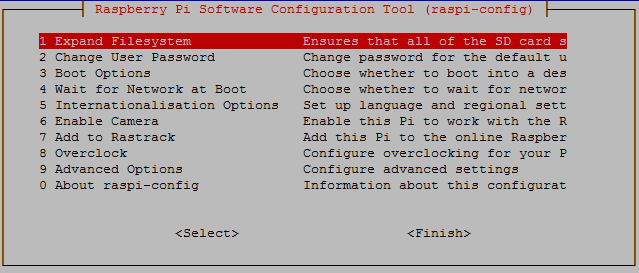

-----
title: 树莓派配置记录备份
tags: 
   - 树莓派
-----


树莓派版本2016-09-23-raspbian-jessie.zip

### 一、将树莓派根分区扩展到整张sd卡


1、选择Expand Filesystem进行扩展
2、顺便修改下Password

### 二、开启root用户
```
sudo passwd
```
后输入两次root用户密码

### 三、给树莓派设置固定dns
```
#执行 
sudo nano /etc/resolv.conf.head
#添加内容如下：
nameserver 114.114.114.114
```


### 四、给树莓派指定ip，网关
```
sudo nano /etc/dhcpcd.conf

# 指定接口 eth0
interface eth0
# 指定静态IP，/24表示子网掩码为 255.255.255.0
static ip_address=192.168.1.105/24
# 路由器/网关IP地址
static routers=192.168.1.1
```
重启，验证下树莓派是否能够正常上网

### 五、将树莓派作为家里的网关
打开 NAT 网关，执行
```
 sudo nano /etc/sysctl.conf
```
修改指定行为：
```
net.ipv4.ip_forward=1
```
然后在家里路由器的DHCP服务器里的网关设置为树莓派ip(当然要先给树莓派一个固定ip了)

### 六、使用树莓派屏蔽家里的广告
```
curl -s "https://raw.githubusercontent.com/jacobsalmela/pi-hole/master/automated%20install/basic-install.sh" | bash
```
一个命令搞定，然后在路由器的DHCP服务器指定到树莓派ip

### 七、git server搭建
1、树莓派包含git可以直接使用
2、使用ssh协议（ssh://）
3、使用win下的id_rsa.pub 上传到树莓派中的/home/pi/.ssh/authorized_keys中，一行一个（win下的是有分成两行）；另外需要修改authorized_keys这个文件的用户组为pi。
```
chown pi:pi authorized_keys
```

### 八、samba 搭建
```
sudo apt-get install samba
sudo apt-get install samba-common-bin
```
1、删除home share dir
2、增加下列配置
```
[Play]
     comment =Pi Play
     path = /media/pi/play/
     read only = no
     public = yes
     guest ok = no
```
3、重启samba
```
sudo /etc/init.d/samba restart
```

### 九、硬盘休眠
挂载了两个硬盘，一个硬盘不常用，设置休眠省电、静音。

查看硬盘设备名，一般就是/dev/sda,dev/sdb之类的
```
sudo blkid
```
确认为/dev/sda

```
sudo nano /etc/hdparm.conf
```
spindown_time值乘以 5 得到总的时间（单位秒）. 例如想配置成空闲10分钟就休眠，spindown_time = 10 * 60 / 5 = 120
增加
```
/dev/sda {
write_cache = on
spindown_time = 120
poweron_standby = on
}
```